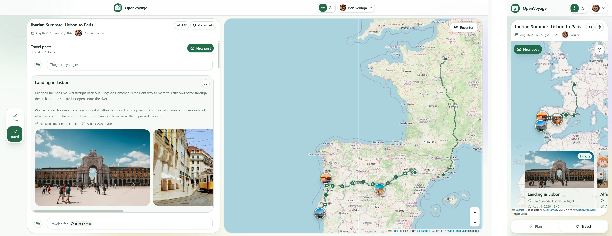

# OpenVoyage
An open source self-hosted travel planner and travel blog, for you and the people
**you** choose to share it with.



OpenVoyage is a part of your whole trip, from planning to traveling. Before you
leave, you create an itinerary of the places you intend to visit and how long
you plan to stay there. Then once on the go, you create posts at a given 
location and time. People you have chosen to share it with see a timeline with
your posts and a small overview of where you are going. 

Using the [OpenVoyage mobile app](#-android-app), you can also record where you 
have been and show it on the map.

You are in control. Your trip, your photos, your GPS, your choice. 

> **Early days.** OpenVoyage works and is used for real trips, but it is
> pre-1.0 and moving fast. Expect rough edges, occasional breaking changes
> between versions, and read the release notes before you upgrade. Back up
> your `data/` directory and your database.


## ⭐ Features

| Feature                       | What it does                                                                                                                                                             |
|-------------------------------|--------------------------------------------------------------------------------------------------------------------------------------------------------------------------|
| 🗓️ **Planning**              | Plan stops, dates, stays, and travel between places. View the itinerary on the map and update it along the way.                                                          |
| 📍 **Tracking**               | Record your route in the background with the Android app, even while offline. Choose a tracking mode, add privacy zones, and decide whether to share your live location. |
| 📸 **Posting**                | Add posts with a place, time, photos, and videos. Save drafts or publish them to the trip timeline and map.                                                              |
| 🔗 **Sharing**                | Make a trip public, add selected viewers, or share a private link with people who do not have an account. Links can expire or be revoked.                                |
| 🧳 **Travelling together**    | Add trip members who can update the itinerary and write their own posts in the shared timeline.                                                                          |
| 🗺️ **Map and timeline**      | Explore planned stops, recorded tracks, travel routes, and posts on one map or in chronological order.                                                                   |
| 🏠 **Your server, your data** | Self-host OpenVoyage and keep control of your accounts, media, trip details, and GPS data.                                                                               |

## 🚀 Quick start
The quickest way to run OpenVoyage is Docker Compose.

```bash
cp .env.example .env
```

Before the first start, open `.env` and fill in two values.

**`SECRET_KEY`** signs every access, refresh, and media token. There is no
default and the application will not start without it. Generate one using the 
command below or find another method of generating a random string.

```bash
python -c "import secrets; print(secrets.token_urlsafe(32))"
```

Keep it stable afterwards. Changing it signs everyone out, makes values of
saved secret settings (such as routing API keys) unreadable.

**`POSTGRES_PASSWORD`** is the database password. Any long random string.

Then start it:

```bash
docker compose up -d
```

Open <http://localhost:8000> and set up your OpenVoyage instance.

Uploads live in `./data/media` on the host; PostgreSQL data lives in the
`postgres_data` Docker volume. 

### Upgrading

```bash
docker compose pull && docker compose up -d
```

Set `OPENVOYAGE_IMAGE` in `.env` to pin a version (`:1.2.3`), track a release
candidate (`:1.2.3-rc1`), or follow `main` (`:edge`) instead of the default
`:latest`. To run your own build, `docker build --tag openvoyage:local .` and
point `OPENVOYAGE_IMAGE` at it.

### A note on secrets

Deployments refuse to start on a placeholder or example secret. Set
`ENVIRONMENT=local` in `.env` to downgrade those checks to warnings while
working on a throwaway local checkout — never on anything reachable by someone
other than you.

## ⚙️ Configuring your instance
Most day-to-day configuration lives in the in-app admin interface rather than
in environment variables, so you can change it without a restart.

Environment variables cover the things that must be known before the app
starts liek: database connection, `SECRET_KEY`, CORS origins, media directory. See
[`.env.example`](.env.example) for the full annotated list.

## 📱 Android app
The android app is only needed to track your location in the background. Other
than that, it is the same interface as the web app. Because it is your choice,
you can choose from various modes to track your location in the background.
GPS tracking also works offline.


### Installing

Tagged releases attach an APK to the
[GitHub release artifacts](https://github.com/bobveringa/OpenVoyage/releases).
It is currently a debug build, so Android will ask you to allow
installation from an unknown source, and it will not update itself.

Publishing on the playstore is a definite maybe.
There are no plans for an IOS build (and that is unlikely to change, unless
apple makes some significant changes in the way they do business)

To build it yourself:

```bash
cd frontend && npm ci && npm run android:apk
```

You need a JDK between 17 and 24, and the Android SDK. The APK lands in
`frontend/android/app/build/outputs/apk/debug/`.

### Pointing it at your server

On first launch the app asks for your server's address — for example
`https://voyage.example.com`, or `http://192.168.1.10:8000`. Plain HTTP to a 
LAN address works.

### Permissions it asks for, and why

| Permission                      | Why                                                                                                                          |
|---------------------------------|------------------------------------------------------------------------------------------------------------------------------|
| **Location**                    | Recording your track. Nothing is recorded until you start a tracking session.                                                |
| **Background location**         | Keeps the track going when the app is not in the foreground.                                                                 |
| **Notifications**               | Android requires a visible notification while a background recording runs. It is also how you see that tracking is still on. |
| **Ignore battery optimisation** | Optional, but without it Android will eventually put the app to sleep mid-journey and leave a gap in your track.             |

## 📍 Data attribution

Place search, autocomplete, and reverse geocoding are powered by
[GeoNames](https://www.geonames.org/) data, used under the
[Creative Commons Attribution 4.0](https://creativecommons.org/licenses/by/4.0/)
license. Map tiles are provided by
[OpenStreetMap](https://www.openstreetmap.org/copyright) contributors.

## 🏷️ About the name

The name "OpenVoyage" comes from the name my girlfriend gave the project when
I initially started working on it: "BobVoyage" (get it, it's like the French
"Bon Voyage", but with my name instead of *bon*) she is very funny. But
having my name in the project weirded me out, so I changed it to OpenVoyage,
which is more fitting for an open-source project.

## Why I build it

There is a popular unnamed app that is very popular in the Netherlands, however, 
it is not open source and while they appear to be somewhat privacy conscience, 
I strongly prefer to be fully in control of my own data.

Looking online, the closest thing I could find was [AdventureLog](https://github.com/seanmorley15/AdventureLog).
Which is a very cool project, but not what I was looking for as a replacement
for the popular unnamed app.

So I built OpenVoyage. To do exactly all the things that I want it to do.


## 🤖 Use of AI

This project was developed with the assistance of AI tools, which helped with
code generation, debugging, and documentation. However, all code was reviewed
and tested by humans to ensure quality.

The usage of AI tools for contributions to this project is allowed. However,
PRs that add hundreds of lines of code without collaboration, discussion or
explanation will be rejected without review, regardless of the quality of the
code, or whether it was generated by AI or not.

## 📜 License
OpenVoyage is licensed under the GNU AFFERO GENERAL PUBLIC LICENSE v3.0. 
See [LICENSE](LICENSE.md) for more details.
